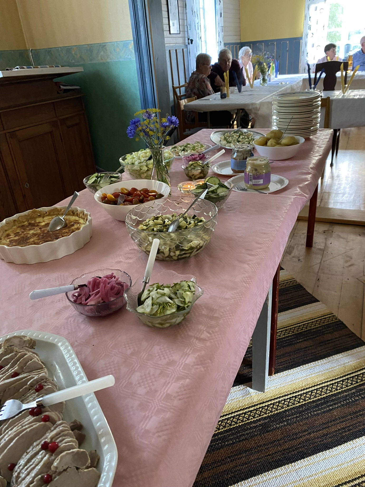

Den 17 augusti 2024 var det så dags för den årliga höstfesten. Ett 25-tal medlemmar mötte upp. Det serverades en härlig buffé som blev mycket uppskattad.

En gäst fick förhinder men skickade en liten hälsning - från Svante Öhman med en liten penninggåva. Stort tack.

Sista aktiviteten för denna säsong är "Berättarcafé" med Per Sander från Länsstyrelsen som kommer att prata om Världsarvet Höga kusten, bland annat kommer han att prata om Storön med mera.

Detta Berättarcafé äger rum den 15 september 2024 kl 14.00 på Utviks bygdegård. Där kommer det att finnas kaffe med dopp till försäljning.

Årets sista styrelsesammanträde är den 21 september 2024 kl 11.30 hos Gunilla Zetterlund Nordin på Utviksnäset.

Väl mött!

Styrelsen

---

<!--  -->

