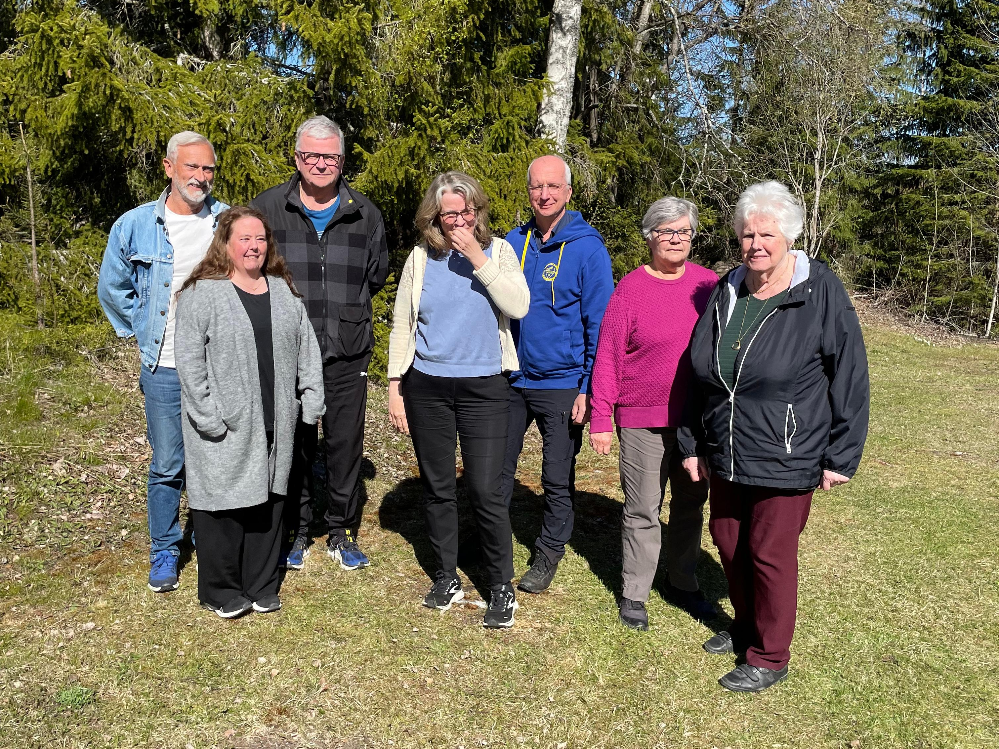


Allmän information kring bygdegårdsföreningen


<!-- ## Historia -->

## Föreningsinformation

<!-- Medlemsantalet i August 2024 är 92 stycken. -->

Styrelsen för verksamhetsår 2025/2026 presenteras i tabellen nedan.

|                           |                               |
| :------------------------ | :---------------------------- |
| Kent Olofsson             | ordförande                    |
| Lennart Carlsson          | vice ordförande               |
| Marianne Olofsson         | sekreterare                   |
| Gunilla Zetterlund Nordin | kassör                        |
| Britt-Marie Forslin       | ledarmot                      |
| Linda Nordlander          | ledarmot                      |
| Bengt Rödlund             | ledarmot / fastighetsskötsel  |
| Ewa Carlsson              | fotograf                      |

---

## Om denna webbplats

Webbansvarig är Elias Olofsson. Vid frågor vänd er till <kontakt@utviksbygdegard.se>.

Denna webbplats byggs med [Hugo](https://gohugo.io/) och [Congo](https://github.com/jpanther/congo), samt tillhandahålls av [Netlify](https://www.netlify.com/).
